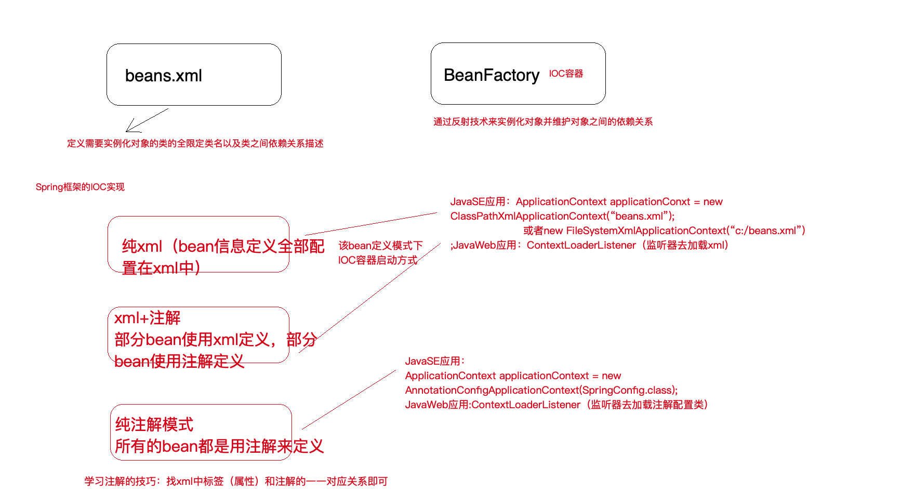

# spring IoC 应用


### 第1节 Spring IoC基础

 **1.1 BeanFactory与ApplicationContext区别**
 BeanFactory是Spring框架中IoC容器的顶层接口,用来定义一些基础功能,定义一些基础规范,而 ApplicationContext是它的一个子接口，所以ApplicationContext是具备BeanFactory提供的全部功能的。
通常，我们称BeanFactory为Spring IoC的基础容器，ApplicationContext是容器的高级接口，比 BeanFactory要拥有更多的功能，比如说国际化支持和资源访问(xml，java配置类)等等。


**依赖注入以及启动IoC容器的方式**
依赖注入方式三种：纯xml、xml+注解、纯注解，启动IoC容器方式两种：Java环境下启动、Web环境下启动。



**1.2 纯xml模式**

**实例化Bean**

 1. 使用无参构造函数
     
``` xml
<!--配置service对象-->
<bean id="userService" class="com.lagou.service.impl.TransferServiceImpl"> </bean>
```
 2. 使用静态方法
    不常用，例如加载数据库驱动
	 
``` xml
<!--使用静态方法创建对象的配置方式-->
<bean id="userService" class="com.lagou.factory.BeanFactory"
      factory-method="getTransferService"></bean>
```
 3. 使用实例方法
``` xml
<!--使用实例方法创建对象的配置方式-->
<bean id="beanFactory" class="com.lagou.factory.instancemethod.BeanFactory"></bean> <bean id="transferService" factory-bean="beanFactory" factory- method="getTransferService"></bean>
```
**依赖注入分类**
 1. 构造函数注入：利用带参构造函数实现对类成员的数据赋值。
> constructor-arg ，该标签有如下属性: name:用于给构造函数中指定名称的参数赋值。 index:用于给构造函数中指定索引位置的参数赋值。 value:用于指定基本类型或者String类型的数据。 ref:用于指定其他Bean类型的数据。写的是其他bean的唯一标识。

 2. set方法注入：通过类成员的set方法实现数据的注入。
    

> 需要使用 property 标签，该标签属性如下: name:指定注入时调用的set方法名称。(注:不包含set这三个字母,druid连接池指定属性名称) value:指定注入的数据。它支持基本类型和String类型。 ref:指定注入的数据。它支持其他bean类型。写的是其他bean的唯一标识。

 3. 注入类型有：基本类型和String，其他Bean类型(对象)，复杂类型(Aarry\List\Set\Map\Properties)

> 一类 是List结构(数组结构)，一类是Map接口(键值对) 
> 在List结构的集合数据注入时， array , list , set 这三个标签通用，另外注值的 value 标签内部 可以直接写值，也可以使用 bean 标签配置一个对象，或者用 ref 标签引用一个已经配合的bean 的唯一标识。
在Map结构的集合数据注入时， map 标签使用 entry 子标签实现数据注入， entry 标签可以使 用key和value属性指定存入map中的数据。使用value-ref属性指定已经配置好的bean的引用。 同时 entry 标签中也可以使用 ref 标签，但是不能使用 bean 标签。而 property 标签中不能使 用 ref 或者 bean 标签引用对象

 **附1 Bean的作用范围和生命周期**
 singleton\prototype\request\session\application\websocket
 不同作用范围的生命周期
***单例模式:singleton***
对象出生:当创建容器时，对象就被创建了。 
对象活着:只要容器在，对象一直活着。
对象死亡:当销毁容器时，对象就被销毁了。 
一句话总结:单例模式的bean对象生命周期与容器相同。 
***多例模式:prototype***
对象出生:当使用对象时，创建新的对象实例。 
对象活着:只要对象在使用中，就一直活着。 
对象死亡:当对象⻓时间不用时，被java的垃圾回收器回收了。 
一句话总结:多例模式的bean对象，spring框架只负责创建，不负责销毁。

**1.3 xml与注释相结合模式**

> ***第三方jar中的bean定义在xml，自己开发的bean定义使用注解***
常用注释：
@Component、@Scope、@Autowired、@Qualifier、@Resource(在 Jdk 11中已经移除)
> 
> 1、针对分层代码开发提供了@Componenet的三种别名@Controller、 @Service、@Repository分别用于控制层类、服务层类、dao层类的bean定义，这 四个注解的用法完全一样，只是为了更清晰的区分而已
> 2、PostConstruct，注解加在方法上，该方法就是初始化后调用的方法；@PreDestory，注解加在方法上，该方法就是销毁前调用的方法

**1.4 纯注释模式**
常用注释
@Configuration 注解，表名当前类是一个配置类
@ComponentScan 注解，替代 context:component-scan
@PropertySource，引入外部属性配置文件
@Import 引入其他配置类
@Value 对变量赋值，可以直接赋值，也可以使用 ${} 读取资源配置文件中的信息 @Bean 将方法返回对象加入 SpringIOC 容器