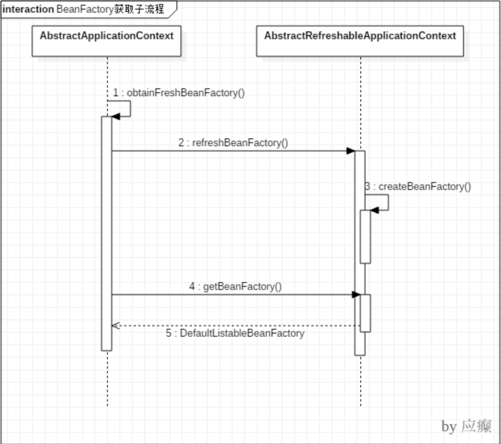
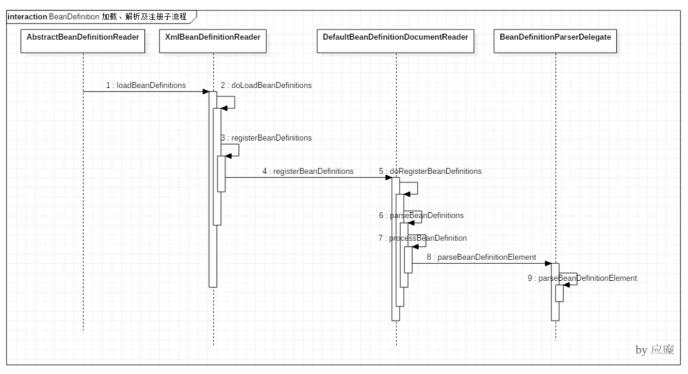

# spring IoC 应用

### 第2节 BeanFactory创建流程

 **2.1 获取BeanFactory子流程**
 时序图
   
   
 **2.2 BeanDefinition加载解析及注册子流程**
 Resource定位:指对BeanDefinition的资源定位过程。通俗讲就是找到定义Javabean信息的XML文 件，并将其封装成Resource对象。将XML封装成Resource对象。
 
BeanDefinition载入 :把用户定义好的Javabean表示为IoC容器内部的数据结构，这个容器内部的数 据结构就是BeanDefinition。读取Resource对象转换成BeanDefinition。

注册BeanDefinition到 IoC 容器

**2.2 BeanDefinition加载解析及注册子流程**

Step1: 入口在AbstractRefreshableApplicationContext#refreshBeanFactory 方法中
Step2: 调用多个类的 loadBeanDefinitions 方法 ​ —> AbstractXmlApplicationContext ​ —> AbstractBeanDefinitionReader —> XmlBeanDefinitionReader ​ 一直执行到 XmlBeanDefinitionReader 的 doLoadBeanDefinitions 方法

所谓的注册就是把封装的 XML 中定义的 Bean信息封装为 BeanDefinition 对象之后放入一个Map中，BeanFactory 是以 Map 的结构组织这些 BeanDefinition 的。

时序图

### 第3节 Bean创建流程**
Bean创建子流程入口在AbstractApplicationContext#refresh()方法的finishBeanFactoryInitialization(beanFactory) 处

工厂Bean或者普通Bean，最终都是通过getBean的方法获取实例，创建Bean实例，给Bean填充属性，调用初始化方法，应用BeanPostProcessor后置处理器

